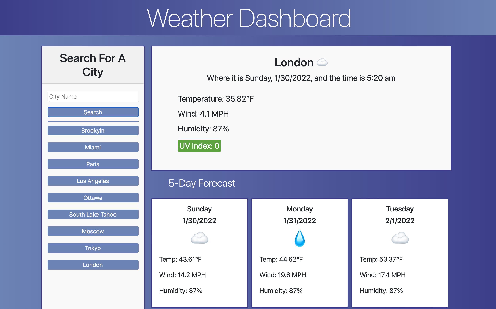

# Weather Dashboard with Custom Buttons

Made with Javascript, Jquery, Bootstrap, the Openweather API, and the MyPTV Geocoding API!

https://mrsumada.github.io/custom-buttons-weather-dashboard/

## How to Use

* Just type your city into the text input field, and hit "Search".  Next you'll be seeing that city's temperature, humidity, 5-day Forecast, and more!

* If you search for your city for the first time, a custom button will be generated and stored. That way you can easily look up that same city the next time you visit your dashboard!

* Store up to 10 cities! Make this Dashboard your own!

-Adam
